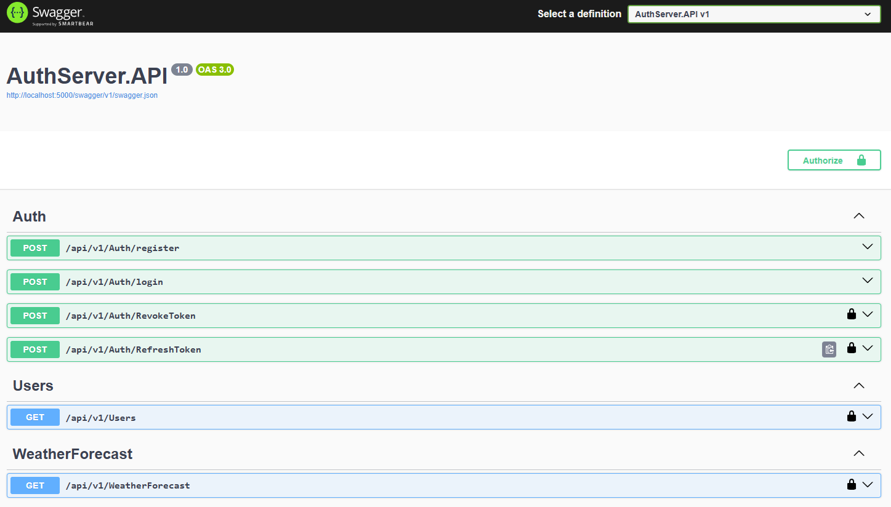

# AuthServer
This project develops a RESTful Authentication and Authorization service, designed to handle user management and secure access control through JWT tokens. Below are the core functionalities implemented in this API:
### Features

- **User Registration**: Users can sign up by providing an email and a password.
- **User Authentication**:
  - Validates user credentials.
  - Returns a JWT (JSON Web Token) upon successful authentication.
- **Token Authorization**:
  - Clients must send the token with each request to access the service.
  - Implements token expiry checks and error handling, providing appropriate error codes for different failure scenarios.
- **Token Revocation**:
  - Provides a method for revoking tokens from the backend, enhancing security by preventing the use of outdated or compromised tokens.
- **Token Refresh**:
  - Allows clients to renew their tokens before expiry to maintain continuous access without re-authentication.
 
 ## Technologies Used
* C#
* .NET 8
* ASP.NET Core
* Serilog

## How to use
1. Download the AuthServer V1.0 from Release 
2. Launch the AuthServer.API.exe
3. Open URL: "http://localhost:5000/swagger/index.html" or Use Postman with base URL: "http://localhost:5000"
   
   
   
5. Use the following details to test the APIs: 

    | Email  | Password |  Role |
    | ----- | -------- | -------- |
    | abc@xyz.com | test |  Admin, User |
    | 123@xyz.com | test |  User |
    | wsad@xyz.com | test |  User |
    
    **Table 1:** Test data
6. API Routes and their request bodies:
    | Method | URL                                       | Request Body                                      |
    |--------|-------------------------------------------|---------------------------------------------------|
    | POST   | http://localhost:5000/api/v1/Auth/register| `{ "email": "string", "password": "string", "uSerRole": [""] }` |
    | POST   | https://localhost:5000/api/v1/Auth/login  | `{ "email": "string", "password": "string" }`     |
    | POST   | https://localhost:5000/api/v1/Auth/RevokeToken | `{ "token": "string" }`                           |
    | POST   | https://localhost:5000/api/v1/Auth/RefreshToken | `{ "userEmail": "string", "refreshToken": "string" }` |
    | GET    | https://localhost:5000/api/v1/Users       | `{}`                                              |
    | GET    | https://localhost:5000/api/v1/WeatherForecast | `{}`                                              |

    **Table 2:** API Endpoints

## Upcoming changes
* Database connectivity
* Managing secret
* Refactor code for database logic
* Improve Performance   
